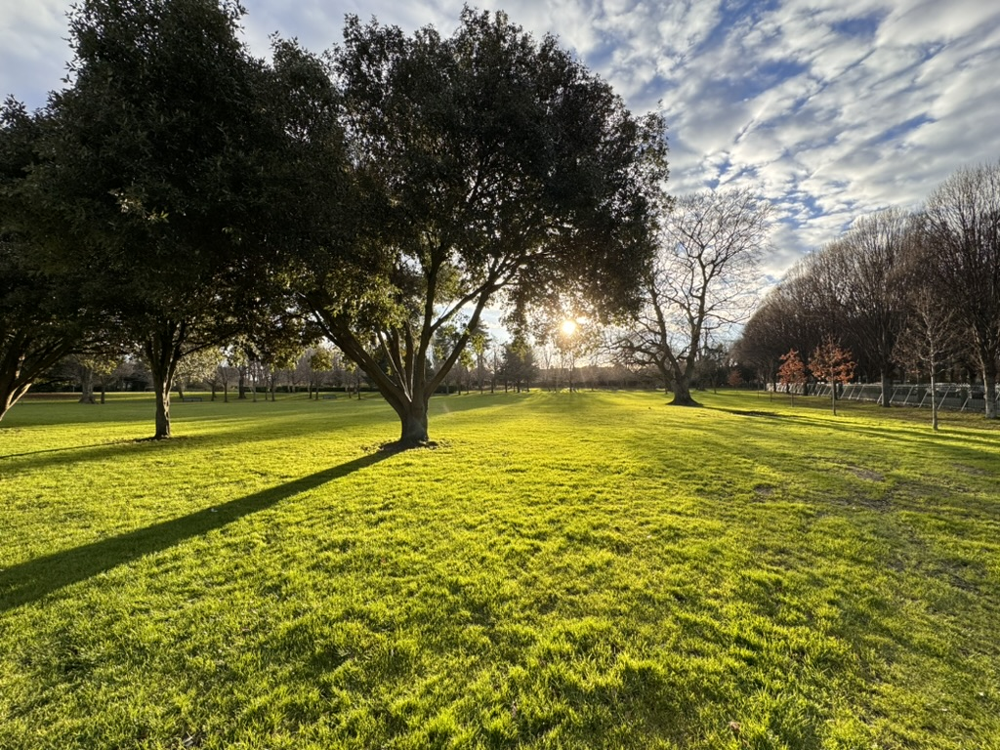

A machine learning engineer living in Dublin, Ireland, focusing mostly on NLP. I am more drawn to the ethical and social impact conversation related to AI lately.

I love cooking. My ideal male model has always been somebody who can support one's family with both money and food, grew up watching my father, my grandfathers from either side, providing for the family with dishes I still relish today. Food or cooking has been a huge portion of my childhood, my culture, and my identity.

Cooking is so habitual to me that I often need to remind myself that not all is interested in or good at it. I would feel attacked if someone dismisses it as a hobby because everyone does it, like part of me suddenly tarnishes.

I am trying to pick up my reading and writing habits again. I used to journal a lot in high school, then I stopped after graduation. Life has been busy.